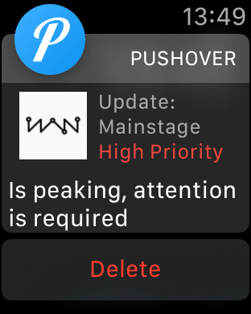
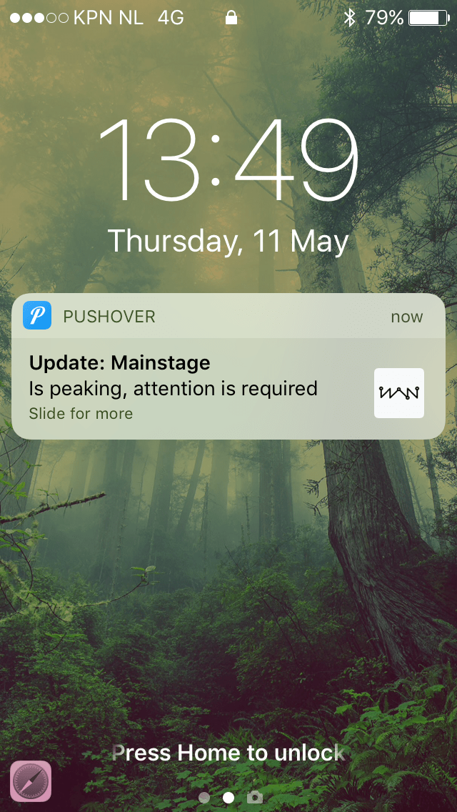
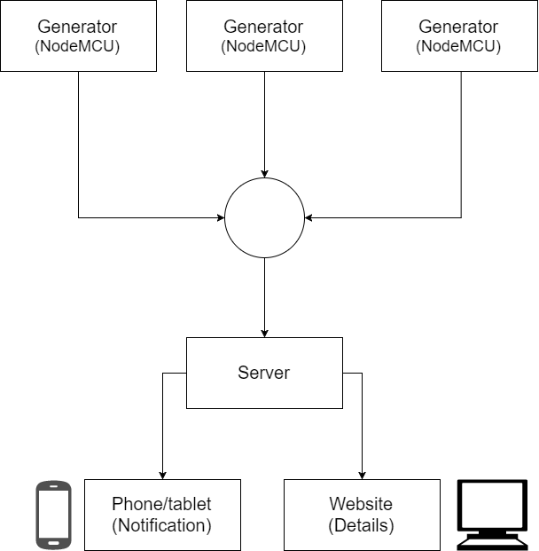

# Watt now

<!-- ______________________ EISEN ______________________
- [ ] Goede README bij de team-repo op Github (incl. Install notes, purpose, future work)
- [ ] Er moet real life data gemeten worden die real-time ergens gevisualiseerd wordt
- [x] Het moet nuttig zijn, je moet kunnen verdedigen dat het stroomverbruik zou verminderen
- [ ] Real life en real-time: Er moet real life data gemeten worden die real-time ergens gevisualiseerd wordt zodat eindgebruikers actie kunnen ondernemen.
- [ ] Er moet minimaal een databron/input-stroom zijn waarvan je kan verwachten dat die tijdens het festival verandert (dus niet ALLEEN het programma)

Demo’s kunnen eventueel gescript worden (dispatch zelf events adhv jouw scenario)
___________________________________________________ -->

Watt now: [Live demo](#)

## Concept
The server recieves data from the generators (Watt-Now sensors), the timetable for all the acts and a list with all the energy zones. By using these datasets the server predicts what generators need to be used at what time and for what task.

When the server predicts a spike in the energy useage. The maintenance crew will get a notification on there phone, that tells them what energy zone needs a bigger/smaller generator or when to turn them off. By doing this the maintenance crew can easyer keep track of the generator and energy usage and the generator usage will go down, what is cheaper for the organisation.

## Usage
- Watt-Now has installed the different sensors, that keep track of the generators data and power usage.
- The data from the generators and the power usage gets send to the server, that collects the data for every power grid.
- The server predicts based on previes collected data and on the event program, if there will be a possible power spike in the next 20 a 30 minutes.
- If the server detects, that there will be a power spike/ power dip, it will send a notification to the on-site technicians.
- The on-site technicians will recieve the notification, that tells them what generator can be turned on/off.
- The on-site technicians will go to the generators and will turn a generator on/off depending on the power demand.

- If at any moment, the event organisator, Watt-Now or any of the on-site technicians want to see the generator data, he/she can go to the online dashboard and can see the live data of all the generators.

<!-- ## Monitoring / Possible generators
- Schuko (16A) generator
- 32A generator
- 63A generator
- (125A) generator
- Powerlock (400A) generator -->

## Stakeholders
- <strong>On-site technicians </strong>: The on-site technicians want everything to work propperly, want to prefent possible problems and want real-timel information of the generators wherever they are.
<br/><br/>
Our Idea is a real-time dashboard, where the on-site technicians can see the energy usage of all the generators. It will also help the on-site technicians by predicting, when there will be a power spike, so that the technicians can use a stronger generator, to prefent possible power shortage  or overuse.
<br/><br/>

- <strong>Event organisator </strong>: The event organisator wants to keep the costs as low as possible and he/she wants to prefent overcapacity of the generators.
<br/><br/>
Our idea will give the event organisator a real-time dashboard, with live data about all the generators and there usage. This way, the event organisator can keep better track of the generator capacity and will have a better idea of the total usage and costs.
<br/><br/>

- <strong>Watt-Now </strong>: Watt-now wants to have real-time data about the generators and want to be able, to predict possible power spikes.
<br/><br/>
Our idea will give Watt-now a real-time dashboard, that is easy to understand, that shows the live generator data and will also show, when a generator needs to be updated, or when a smalle generator can be used.

## Features
- Live data collection from the generators.
- Datavisualisation of the collected data.
- Real-time data updates.
- Power usage predictions.
- Notifications, to predefined mobile devices.

## Push notifications
For the push notifications we used an external service called [Pushover](https://pushover.net/). This service makes it possible to push messages to different device for example; Apple iPhone, Apple Watch, Android smartphone and Android smartwatch (this is just a little part the devices that are [supported](https://pushover.net/clients)). They also got an API for sending messages, so we can make our own wrapper to send messages to the subscribed users (in our case the on-site technicians).


**[Pushover API documentation](https://pushover.net/api)**

### Getting started with Pushover
To use Pushover some actions are required. Some steps are for the administrator only (I'll mention that where needed).

#### 1. Create a Pushover account
Create an account add [pushover.net](https://pushover.net/).

#### 1.1. Create a Pushover app (only required for the administrator)
Create an application add [pushover.net/apps](https://pushover.net/apps).
Define the following information when creating the application:
* Name.
* Type > "Application".
* Description.
* URL > the URL where the application will be running for example (http://localhost:3000).
* Icon > Logo for the application.

#### 2. Get the user key to subscribe for the application and receive notifications
Login add [pushover.net](https://pushover.net/) and in the top right of your screen your see ***Your User Key*** blow that you see your unique key that you can pass to the application administrator, so he/she can add you to the notification list.

#### 2.1. Add new users to the notification list (administrator only)
To add an user you need his/hers User Key (see step above). You've to add the User Key to the environment variables and then the key needs to appear in the message loop.

##### 2.1.1. Add key to environment config
Replace **NAME** to the name of the user or something else so you can recognize which user it is.
Replace **PlaceTheUserKeyHere** with the user key.
```
PUSHOVER_USER_KEY_NAME=PlaceTheUserKeyHere
```

##### 2.1.2. Add the user to the message loop
Go to `push-message.js` and add the new user.
```javascript
const users = [
    // Default user most likely the administrator
    process.env.PUSHOVER_USER_KEY,
    // Added user
    process.env.PUSHOVER_USER_KEY_NAME
  ];
```

#### 3. Push a notification to all the users in the loop
The following router defines the notification title, body and priority.

**::MESSAGENAME::** = status message can be: 
- peak 
- overheating
- efficientLow
- broadbandLow
- additionalGenerator
- lostConnection
- fuelLow
- unknownError
(see messages.js for more details)
**::GENERATOR::** = name of the generator

Example URL:
Go to *http://www.YOURURL.com/demo/::MESSAGENAME::/::GENERATOR::*
The notification that all the users will receive:
* Generator: **::GENERATOR::**
* Message: **::MESSAGENAME:: message body**
* Priority: **::MESSAGENAME:: priority number (2, 1, 0, -1, -2)**

```javascript
// Send push message to receiers bases on url parameters
/*
 Parameter description:
 req.params.generator              = generator name
 messages.::MESSAGENAME::.message      = status update description
 messages.::MESSAGENAME::.priority     = priority of message can be (2, 1, 0, -1, -2) where 2 is the highest priority.

 Function description:
 pushMessages(generator, message, priority)
*/
// app.js (serverside)
app.use('/demo/::MESSAGENAME::/::GENERATOR::', function (req, res) {
  res.send(req.params);
  // Emit to dashboard
  io.emit('::MESSAGENAME::', req.params.generator, messages.::MESSAGENAME::.message, messages.::MESSAGENAME::.priority);
  // Push notification
  pushMessages(req.params.generator, messages.::MESSAGENAME::.message, messages.::MESSAGENAME::.priority);
});

// main.js (clientside)
socket.on('::MESSAGENAME::', (gen, msg, prio) => {
    // Run something
});

```

### Priority of notifications
With Pushover we can send the priority of the notification with the message. There are 5 types of priority but we are using 3 of them. Every priority comes with his own properties and settings. The priorities are placed with numbers (2, 1, 0, -1 and -2) but we only using 2, 1 and 0 where 2 is the highest priority.

**Unique notification sounds:** Pushover supports multiple notification sounds, we defined for each type of priority a different sound so it more clear what the priority of the message is when received.

#### Emergency Priority (2)
This is the highest level op priority this one is used for messages that can't be ignored, the coolest part of this one is that if the receiver is not responding on the message that he or she gets a reminder every minute unit they acknowledge the message. With this functionality we can almost ensure that the user read notification.
The receiver gets a notification with the logo of the Watt-Now and on the smartwatches the title (generator name) is visible add once. The receiver also sees what priority the notification is.

#### High Priority (1)
This one is almost the same as the emergency priority but is not sending a reminder.

#### Normal Priority (0)
This is also the default priority if not specified. The receiver won't get the logo of Watt-Now on his watch and doesn't see what priority the notification is.

### Screenshots
Apple Watch:



Apple iPhone 5s:




## Flow


## Build / Install and start project

### Clone this repo

```
  git clone https://github.com/TimoVerkroost/minor-watt-now
  cd minor-watt-now
```

### Install the dependencies
```
npm install
```

### Environment setup (.env file)
```
VAR=VALUE
```

### Build CSS and JS
This will build the minified and cleaned CSS and JavaScript files.
```
npm run build
```

### Start server
```
npm start
```

### Start server with live updates
```
npm run start-update
```

### Watch changes
```
npm run watch
```

## Finished todo's

## Wishlist
- [ ] Keep track of previeus collected data in a external database, to predict future power usage.
- [ ] Be able, to add the event planning, to be able, to predict how what power zones need more power at a specific time (when a show with a lot of lights starts).

## Collaborators

Timo Verkroost  | Colin Dörr  | Diego Staphorst  
--- | --- | ---
![Timo Verkroost][timo] | ![Colin Dörr][colin]  | ![Diego Staphorst][diego]

## Licence
MIT © Timo Verkroost, Colin Dörr, Diego Staphorst

[timo]: https://avatars2.githubusercontent.com/u/17787175?v=3&s=460 "Timo Verkroost"

[colin]: https://avatars3.githubusercontent.com/u/8983587?v=3&s=460 "Colin Dörr"

[diego]: https://avatars0.githubusercontent.com/u/10053770?v=3&s=460 "Diego Staphorst"
